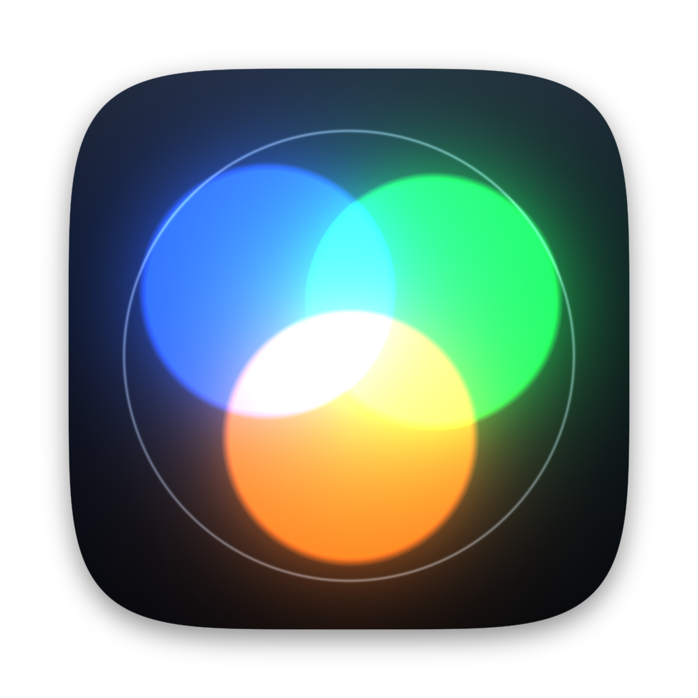
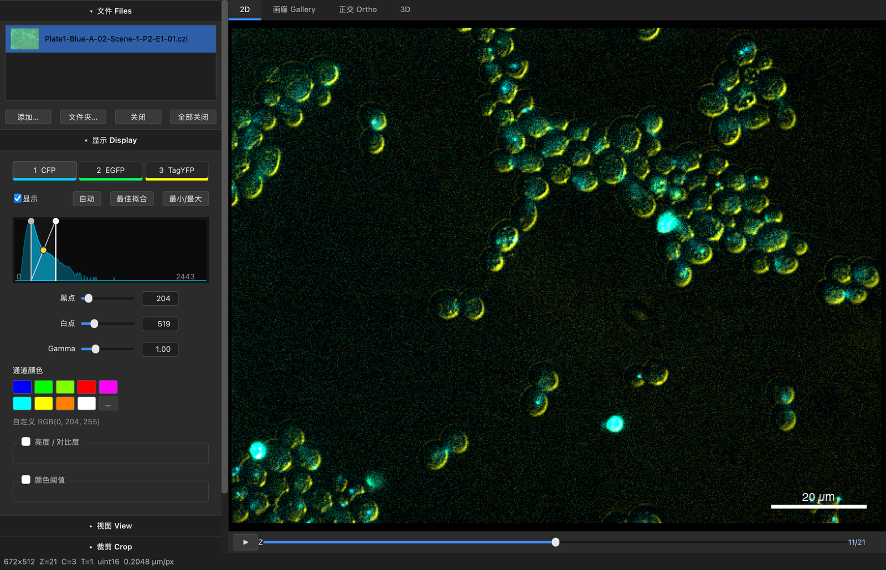
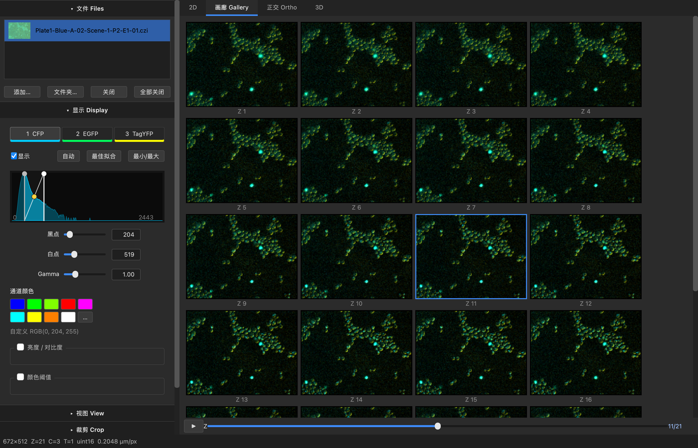
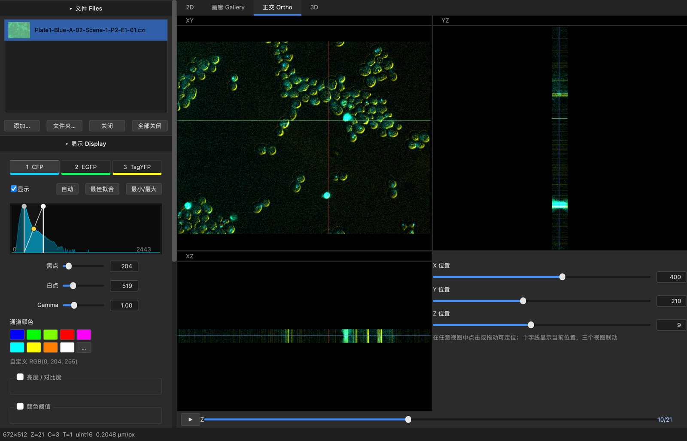
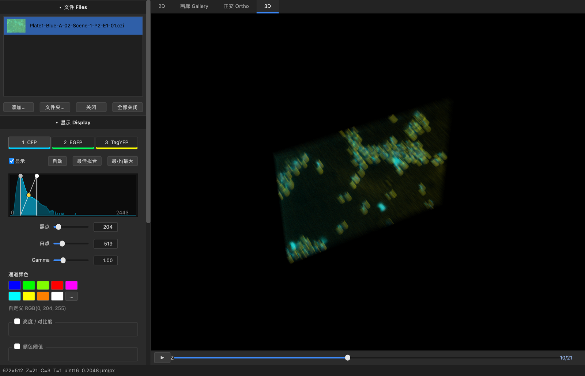
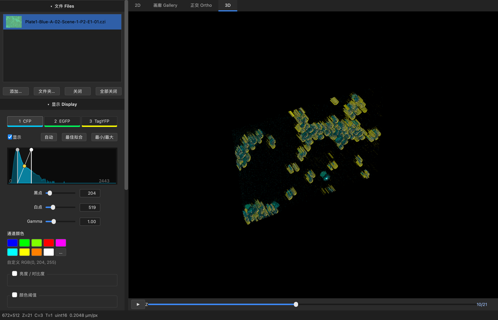
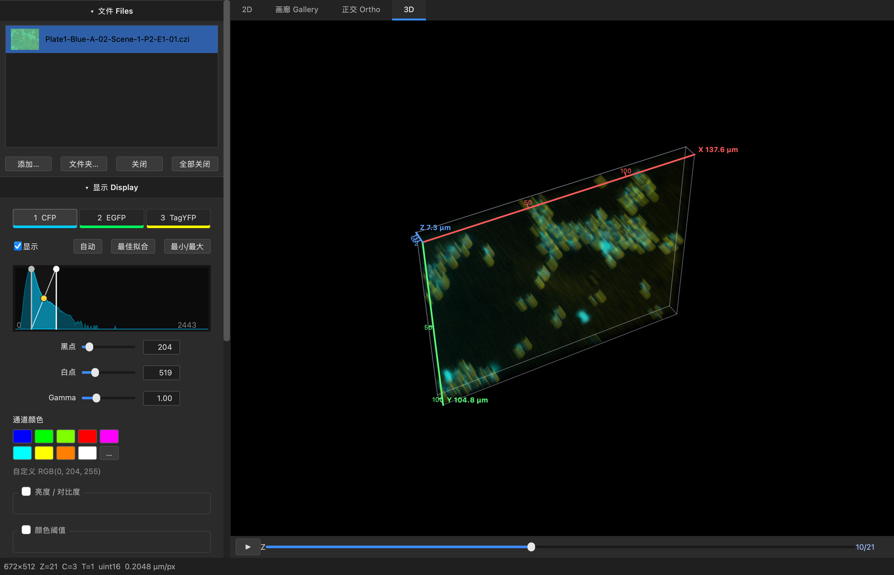
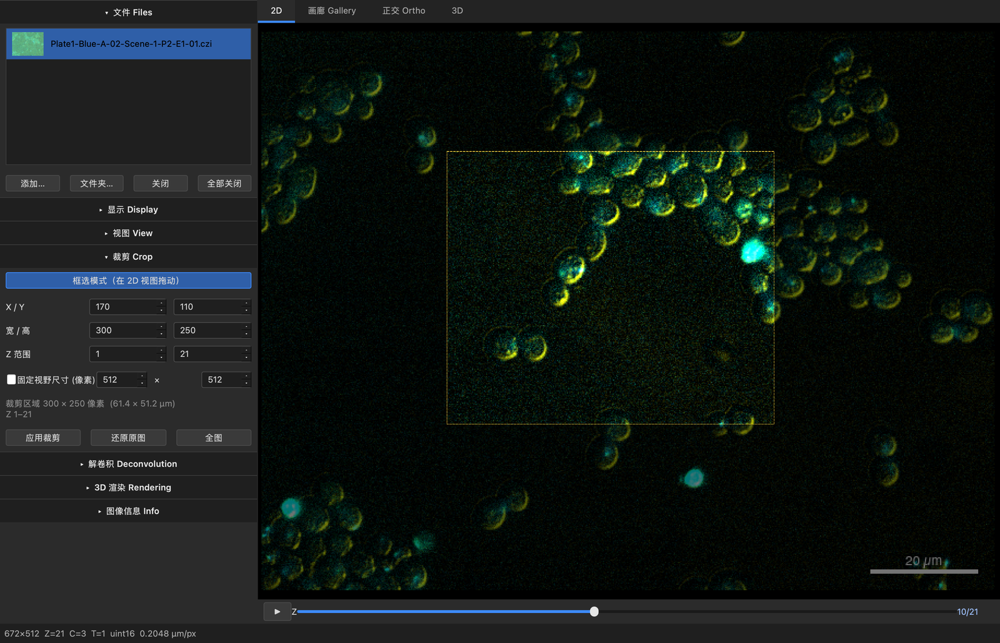
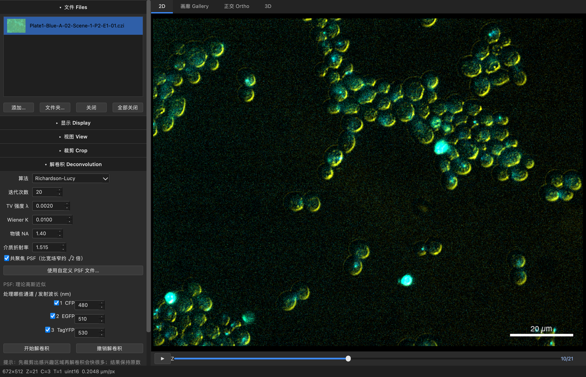

<div align="center">



# Confocal Viewer for Mac

**面向 macOS 的 ZEN 风格共聚焦 / 荧光图像查看与分析工具**
*A lightweight, ZEN-inspired confocal & fluorescence image viewer for macOS*

[-1d1d1f?logo=apple&logoColor=white)](#-安装)
[-41cd52?logo=qt&logoColor=white)](https://doc.qt.io/qtforpython-6/)
[](#-gpu-三维渲染)
[](#-版本与价格)
[](#-示例数据与引用)

[版本与价格](#-版本与价格) · [下载](#-安装) · [功能](#-功能一览) · [使用指南](#-使用指南) · [算法说明](#-算法说明)

<br>



<sub>真实 CZI 数据（酵母细胞，CFP / EGFP / TagYFP 三通道 Z-stack）· 数据来源见 <a href="#-示例数据与引用">示例数据与引用</a></sub>

</div>

<br>

## ✨ 功能一览

<table>
<tr>
<td width="50%" valign="top">

### 🔬 读取与显示
- 打开 **Zeiss `.czi`**、**Nikon `.nd2`**、**Leica `.lif` / `.lof` / `.xlif` / `.xlef`**，以及 `.tif/.tiff`、`.png/.jpg`
- 自动读取通道名、颜色、µm/像素、Z 间距（含多通道、Z-stack、时间序列）
- **文件管理面板**：一次导入多个文件或整个文件夹，左侧列表带缩略图，点击切换；每个文件各自保留裁剪、解卷积和显示设置
- 一个文件里有多个图像时（Leica 的多个 series / 拼图块、Nikon 的多个位置）自动拆成多项
- **2D / 画廊 / 正交 / 3D** 四种视图，⌘1–⌘4 切换；正交视图三个面板带十字线联动
- 比例尺可随时开关，悬停实时显示像素坐标与各通道强度

### 🎨 ZEN 风格通道面板
- 通道标签条（颜色条 + 显示开关）
- **直方图**：拖动黑点 / 白点；**上下拖动曲线中点调 Gamma**
- 「自动」「最佳拟合」「最小/最大」一键设置显示范围
- **8 个固定预设色**（见下表），可自定义
- **所有数值都能直接输入**（黑点、白点、Gamma、亮度、对比度、阈值，以及 3D 角度和透明度），回车确认
- 亮度 / 对比度、颜色阈值（含 Otsu、高亮区域、阳性占比统计）

</td>
<td width="50%" valign="top">

### 🧊 GPU 三维渲染 🔒
- OpenGL 4.1 实时光线投射，拖动旋转 **60 帧/秒级**
- 三种模式：**透明 / 最大值 / 表面**
- 画质 3 档、深度提示、自动旋转、方位 / 俯仰滑块
- **可选显示坐标轴 / 外框**（X/Y/Z 轴带 µm 长度），**刻度**可单独开关，导出时一并画入
- 方位角、俯仰角等参数可直接输入数值
- 显示面板里的改动在 3D 里即时生效
- 不支持 OpenGL 时自动回退到 CPU 渲染

### ✂️ 裁剪与固定视野
- 在 2D 上拖框选区，拖边 / 角缩放
- **固定尺寸视野框**：点击即放，拖动只平移
- 同时设定 **Z 范围**，一键应用 / 还原，可多次裁剪

### 🧪 解卷积
- Richardson-Lucy、**RL + TV 正则**、Wiener、Landweber
- 由 NA / 折射率 / 发射波长生成共聚焦高斯 PSF，或导入实测 PSF
- 后台线程运行，可取消、可撤销

### 📤 导出 🔒
- 当前视图（PNG / TIFF / JPG / BMP）、各通道单独图像
- Z 层多页 TIFF / 图片序列、ImageJ 超栈 TIFF、3D 旋转 GIF

</td>
</tr>
</table>

### 通道预设色

| 预设 | 色值 | 典型染料 / 用途 |
|:--|:--|:--|
| 🟦 蓝 Blue | `#0000FF` | DAPI、Hoechst（405 nm 激发） |
| 🟩 绿 Green | `#00FF00` | Alexa 488、GFP、FITC |
| 🟢 青柠绿 Lime Green | `#80FF00` | 与纯绿区分开（如 GFP 与 YFP 同图时） |
| 🟥 红 Red | `#FF0000` | Alexa 594、mCherry、RFP |
| 🟪 品红 Magenta | `#FF00FF` | Alexa 647、Cy5（远红） |
| 🟦 青 Cyan | `#00FFFF` | CFP、Alexa 430 |
| 🟨 黄 Yellow | `#FFFF00` | YFP |
| 🟧 橙 Orange | `#FF8000` | Alexa 555 / 568、Cy3、TRITC |
| ⬜ 灰 Gray | `#FFFFFF` | 透射光、单色图像 |

默认按通道序号依次取 蓝 → 绿 → 红 → 品红 …，也会按通道名里的染料（如 *DAPI*、*488*、*Cy5*）自动匹配；**文件自带的颜色优先**（CZI / ND2 的通道颜色，Leica 取自 LAS X 的 LUT 设置）。

<br>

## 💰 版本与价格

**免费版可以直接使用，没有时间限制。** 需要 3D 重建和导出时，一次性购买完整版即可：

| 功能 | 免费版 | 完整版 · **¥10 终身** |
|:--|:-:|:-:|
| 打开 CZI / ND2 / LIF / TIFF 等格式，多文件管理 | ✅ | ✅ |
| 2D / 画廊 / 正交视图（十字线联动） | ✅ | ✅ |
| 通道面板：预设色、直方图、Gamma、阈值、比例尺 | ✅ | ✅ |
| 裁剪与固定视野 | ✅ | ✅ |
| 解卷积（Richardson-Lucy / RL-TV / Wiener / Landweber） | ✅ | ✅ |
| 🧊 **GPU 三维重建**（透明 / 最大值 / 表面、坐标轴与刻度） | 🔒 | ✅ |
| 📤 **导出**（当前视图、各通道、Z 层序列、ImageJ 超栈、3D 旋转 GIF） | 🔒 | ✅ |
| 价格 | 免费 | **10 元，一次性付费，无订阅** |

<div align="center">

### 👉 [前往爱发电购买完整版（10 元）](https://afdian.com/item/c347de8cbf0411f18d4052540025c377)

</div>

**购买与激活**

1. 在上面的链接付款（爱发电）。
2. 付款后，在爱发电的**订单详情页**复制**订单号**（一串数字）。
3. 打开软件，菜单 **帮助 → 激活 / 许可证…**，粘贴订单号，点「激活」。
4. 激活成功后 3D 和导出立即解锁，之后**离线也能使用**（只有激活和解绑需要联网）。

**一个订单对应一台电脑。** 想换电脑时，先在旧电脑上点 **帮助 → 激活 / 许可证… → 解绑本机**，再到新电脑激活；每个订单的解绑次数有限，旧电脑已无法操作请联系作者。

**隐私：** 激活时只会把订单号和本机硬件标识的哈希值发送到许可证服务器，用于核对订单和绑定电脑，不会发送其他任何信息；软件平时不联网。

**购买前建议：** 先用免费版打开你自己的数据文件，确认格式、通道、标定都读取正常（尤其是 Nikon / Leica 文件）。遇到问题请到 [Issues](../../issues) 反馈；退款等事宜以爱发电平台规则为准。

<br>

## 📸 使用指南

<table>
<tr>
<td width="50%"></td>
<td width="50%"></td>
</tr>
<tr>
<td align="center"><b>画廊 Gallery</b><br>多层时展示全部 Z 层（点击跳到 2D）；单层时按通道分开显示，并附合成图</td>
<td align="center"><b>正交 Ortho</b><br>XY / XZ / YZ 三个剖面，Z 方向按物理间距缩放；十字线标出当前位置，在任一视图点击或拖动，另外两个视图联动，X / Y / Z 也可直接输入</td>
</tr>
<tr>
<td width="50%"></td>
<td width="50%"></td>
</tr>
<tr>
<td align="center"><b>3D · 透明</b><br>前后合成，保留体内结构</td>
<td align="center"><b>3D · 表面</b><br>首次命中面 + 梯度法线光照</td>
</tr>
<tr>
<td colspan="2" align="center"><br><b>3D · 坐标轴与刻度</b>（可选）：X / Y / Z 轴带物理长度，刻度单独开关；左侧是文件面板</td>
</tr>
<tr>
<td width="50%"></td>
<td width="50%"></td>
</tr>
<tr>
<td align="center"><b>裁剪 Crop</b><br>框选 / 固定尺寸视野 + Z 范围</td>
<td align="center"><b>解卷积 Deconvolution</b><br>算法、PSF 参数与逐通道设置</td>
</tr>
</table>

<details>
<summary><b>⌨️ 快捷键</b></summary>

| 操作 | 快捷键 |
|:--|:--|
| 打开文件（可多选） | ⌘O（或把文件、文件夹拖进窗口） |
| 打开文件夹 | ⌘⇧O |
| 关闭当前图像 | ⌘W（或文件列表里按 Delete） |
| 导出当前视图 | ⌘E |
| 切换 2D / 画廊 / 正交 / 3D | ⌘1 / ⌘2 / ⌘3 / ⌘4 |
| 缩放 / 平移（2D） | 滚轮 / 拖动；双击适应窗口 |
| 旋转 / 缩放（3D） | 拖动 / 滚轮；双击复位缩放 |

</details>

<br>

## 📦 安装

### 下载 DMG（推荐，Apple Silicon）

1. 到 **[Releases](../../releases)** 页面下载 `Confocal-Viewer-for-Mac-<版本>-arm64.dmg`
2. 双击打开，把 **Confocal Viewer for Mac** 拖到 **Applications**
3. **首次打开**：本应用未经 Apple 公证（没有付费开发者签名）。如果提示"无法验证开发者"，请

   - 在「应用程序」里**右键点图标 → 打开 → 再点一次「打开」**；或
   - 在终端执行：
     ```bash
     xattr -cr "/Applications/Confocal Viewer for Mac.app"
     ```

> 安装完成后即可使用免费版；需要 3D 和导出时，见 [版本与价格](#-版本与价格)。

## 🧮 算法说明

### 🧊 GPU 三维渲染
体数据以 16 位 3D 纹理上传（每张纹理 4 个通道，最多 8 通道；XY 最长边超过 768 像素时先做块平均抽样）。LUT 颜色、黑白点、Gamma、亮度/对比度、阈值都在着色器里完成，采样为三线性插值。

| 模式 | 做法 |
|:--|:--|
| 最大值 | 沿射线对每个通道取最大强度，再按通道颜色相加 |
| 透明 | 前到后的 alpha 合成，吸收系数随强度变化，透光率低于 1% 时提前终止 |
| 表面 | 以阈值为等值面找首次命中点，二分细化，用中心差分梯度作法线做头灯光照 |

### 🧪 解卷积
| 算法 | 说明 |
|:--|:--|
| **Richardson-Lucy** | 假设泊松噪声的最大似然迭代，保持总强度、结果非负；是荧光图像的常用基线 |
| **RL + TV** | 在 RL 更新里加入全变分正则，抑制迭代带来的噪声放大 |
| **Wiener** | 频域一次求解，速度最快，容易出振铃 |
| **Landweber** | 简单的梯度迭代，带非负约束，收敛较慢 |

- 卷积使用边缘填充的 FFT，避免边界回绕。Wiener / Landweber 在截断负值后会重新归一化总强度。
- **PSF 为高斯近似**：宽场 σ<sub>xy</sub> = 0.21 λ/NA，σ<sub>z</sub> = 0.66 λ n / NA²；共聚焦近似为两者再除以 √2。这只是近似，定量分析请使用实测 PSF。
- 结果保持原数据类型，可一键撤销。

<br>

## 📚 示例数据与引用

README 中的所有截图都使用下面这份**公开的真实数据**（并非软件自带，也不在本仓库内）：

> **Plate1-Blue-A-02-Scene-1-P2-E1-01.czi** — *Sample Zeiss CZI files* © Ledesma-Fernandez *et al.*
> 来自 Image Data Resource（IDR）数据集 **idr0011**，由 OME 样例图像库整理分发。
> 数据集页面：<https://idr.openmicroscopy.org/search/?query=Name:idr0011-ledesmafernandez-dad4/screenD>
> 下载位置：<https://downloads.openmicroscopy.org/images/Zeiss-CZI/idr0011/>
> 授权：[Creative Commons Attribution 4.0 International (CC BY 4.0)](https://creativecommons.org/licenses/by/4.0/)

这份数据是 3 通道（CFP / EGFP / TagYFP）、21 个 Z 层、0.205 µm/像素的酵母细胞图像。本项目只是用它演示软件界面，**未对原始数据做任何结论性分析**；截图中的显示范围、颜色与视角均为演示用的显示设置。

**算法参考文献**

- W. H. Richardson, *Bayesian-based iterative method of image restoration*, J. Opt. Soc. Am. **62**, 55 (1972).
- L. B. Lucy, *An iterative technique for the rectification of observed distributions*, Astron. J. **79**, 745 (1974).
- N. Dey *et al.*, *Richardson–Lucy algorithm with total variation regularization for 3D confocal microscope deconvolution*, Microsc. Res. Tech. **69**, 260 (2006).
- B. Zhang, J. Zerubia, J.-C. Olivo-Marin, *Gaussian approximations of fluorescence microscope point-spread function models*, Appl. Opt. **46**, 1819 (2007).

**使用的开源库**：[PySide6 / Qt](https://doc.qt.io/qtforpython-6/)、[PyOpenGL](https://pyopengl.sourceforge.net/)、[NumPy](https://numpy.org/)、[SciPy](https://scipy.org/)、[pylibCZIrw](https://github.com/ZEISS/pylibczirw)、[nd2](https://github.com/tlambert03/nd2)、[liffile](https://github.com/cgohlke/liffile)、[PyNaCl](https://github.com/pyca/pynacl)、[tifffile](https://github.com/cgohlke/tifffile)、[Pillow](https://python-pillow.org/)、[PyInstaller](https://pyinstaller.org/)。

<br>

## ⚠️ 说明与局限

- 这是一个**独立开发的软件**，与 Carl Zeiss、Nikon、Leica 等公司无关；"ZEN"、"Zeiss" 等是其所属公司的商标，这里仅用于说明界面风格和所支持的文件格式。
- 解卷积用的是**理论高斯 PSF 近似**，参数填得不准会产生伪影；用于定量分析前请自行验证。
- 软件未做 Apple 公证，首次打开需要手动放行（见 [安装](#-安装)）。

## 📄 许可与作者

**作者：Yi Chen** · [@Cy0109cY](https://github.com/Cy0109cY)

- 本仓库用于发布安装包和说明文档，**不包含源码**。安装包（DMG）是闭源的商业软件，版权所有 © 2026 Yi Chen。
- 使用条款（摘要）：免费版可免费个人使用；完整版授权为**一个订单对应一台电脑**，仅供购买者本人使用；不得转售、再分发安装包或激活信息，不得破解或绕过激活机制。
- 作者保留在遇到滥用时撤销激活的权利。本摘要不构成完整的法律条款，如有疑问请通过 [Issues](../../issues) 联系作者。

> 第三方组件（Qt、pylibCZIrw 等）各自的许可证见 [THIRD_PARTY_NOTICES.md](THIRD_PARTY_NOTICES.md)，应用内也可在「帮助 → 第三方许可证」查看。其中 Qt 和 pylibCZIrw 使用 LGPL-3.0，源码可从各自官方仓库获取（见该文件）。
>
> README 中使用的示例图像另有其授权（CC BY 4.0），见 [示例数据与引用](#-示例数据与引用)。
